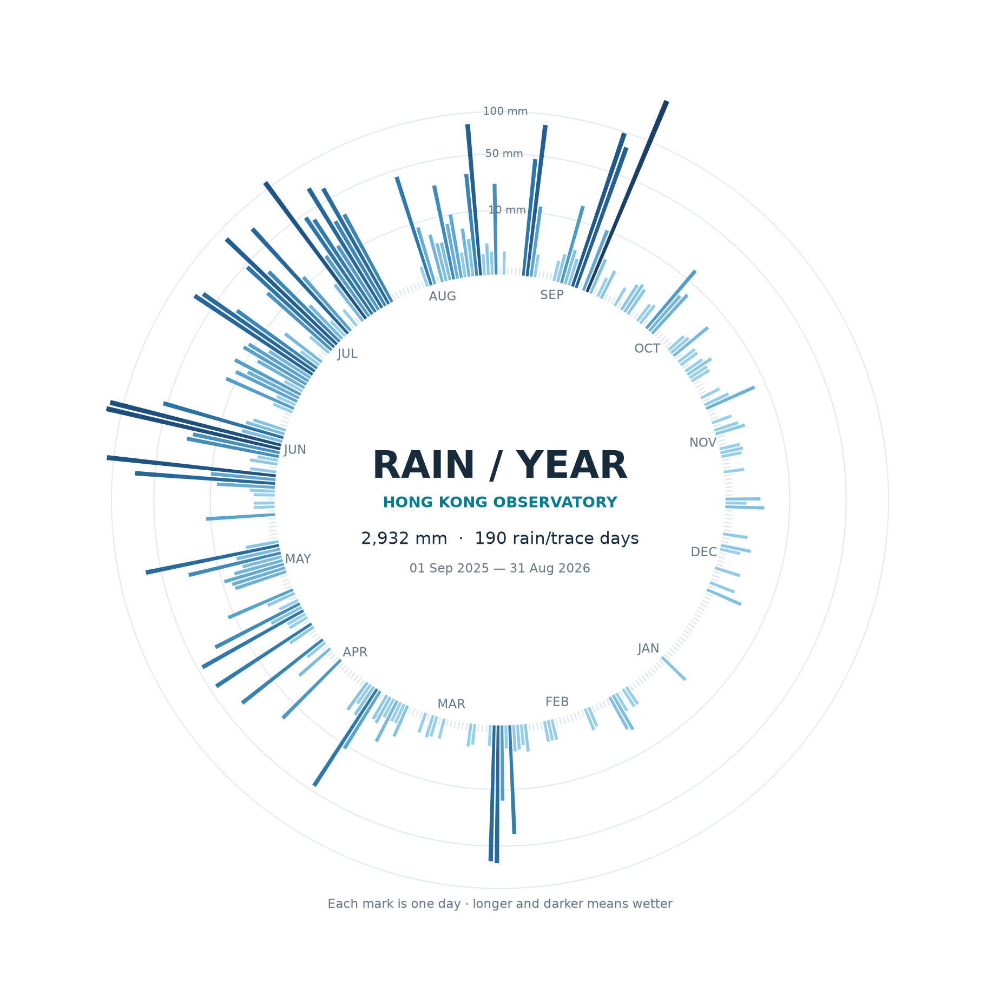

# Hong Kong Rainfall: A Year in a Circle



The main image shows the daily bars. A separate [closed-curve version](out/rainfall_closed_curve.png) shows the same year as a continuous line without bars.

## The phenomenon

Rain in Hong Kong does not arrive evenly throughout the year. Long dry spells can be interrupted by intense rainy days, especially in the warmer months. I wanted to make that uneven rhythm visible without treating a year as just another left-to-right line chart. The circle holds one day in each position, so the pattern of dry and wet periods can be read as a complete year.

## The source

The numbers come from the [Hong Kong Observatory's daily rainfall CSV](https://data.weather.gov.hk/weatherAPI/cis/csvfile/HKO/ALL/daily_HKO_RF_ALL.csv). I fetched the file once and committed the unmodified reply in `data/daily_HKO_RF_ALL.csv`. It contains 49,492 dated rows, from 1884 through August 2026. Each dated row records one day's rainfall at the Observatory in millimetres, together with a data completeness flag. The source defines “Trace” as less than 0.05 mm; the plot represents such days as 0.025 mm.

## What the picture shows

This image uses the latest 365 calendar days in the committed file: 1 September 2025 to 31 August 2026. Each thin mark is a day. More rainfall makes the mark longer and its blue darker; pale inner ticks mark dry days. The period totals about 2,932 mm over 190 days with measurable or trace rainfall. The circular format makes clusters and quiet stretches easy to see, but it compresses the numerical scale with a square-root transformation and does not show when during a day the rain fell. It also describes one observing station, not every part of Hong Kong.

The alternative line-only image lightly smooths daily values and joins the last day to the first to make a closed annual form. Its interior fades from pale to deep blue as radial height increases. It is an artistic interpretation, not an additional measurement; for individual daily amounts, use the bars or source CSV.

## Interactive version

[Explore the rainfall wheel month by month](https://9052g.github.io/hk-daily-rainfall/). It begins with an empty circle. Hover over a month to grow its daily marks from the inner ring; click or tap to keep that month visible, or choose **Show All** to reveal the entire year. The page is generated from the same committed CSV and contains its data, so the generated HTML also works offline.

## Run it

```
uv run plot.py
uv run line_plot.py
uv run site.py
```
